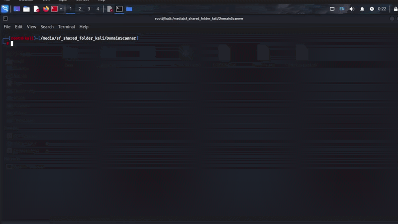
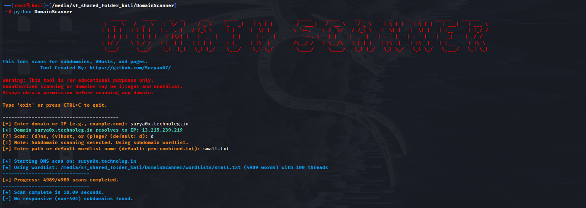
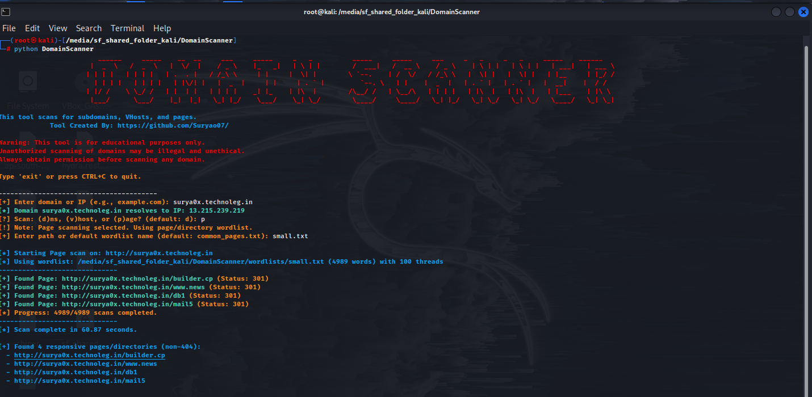

# DomainScanner

> **Fast, multithreaded web reconnaissance**. Discover hidden subdomains, virtual hosts, and directories on your targets.

A lightweight Python tool for discovering subdomains, virtual hosts, and hidden directories on web applications. Perfect for reconnaissance during security assessments.



## 🚀 Quick Start

```bash
# 1. Install
git clone https://github.com/Suryao07/domainscanner.git && cd domainscanner
pip install -r requirements.txt

# 2. Run
python domainscanner.py

# 3. Follow prompts
Enter domain: example.com
Scan: (d)ns, (v)host, or (p)age? d
Wordlist: [press Enter for default]
```

Results appear in real-time. That's it.

## Why This Tool?

When you're doing web reconnaissance, you need to map out the target's attack surface. Industry tools like GoBuster and FFUF are powerful, but they can be heavy. DomainScanner does one job well: **fast, multithreaded enumeration with clean output**.

I built this to understand how enumeration actually works under the hood—beyond just running other people's tools. It became something genuinely useful for penetration testing.

## What It Does

**Three scanning modes:**

| Mode | Purpose | Example |
|------|---------|---------|
| **DNS** | Finds live subdomains | `admin.example.com`, `api.example.com` |
| **VHost** | Discovers vhosts on an IP | Hidden domains hosted on the same server |
| **Page** | Enumerates directories | `/admin`, `/api`, `.git`, `config.php` |

Each mode uses multithreading to check hundreds of possibilities in minutes instead of hours.

## ✨ Features

- **Multithreaded** — 100 concurrent threads by default (configurable)
- **Multiple wordlists** — Small, medium, large, and high-quality combined lists included
- **Live progress tracking** — Real-time scan updates
- **Clean output** — Shows only what matters
- **Timeout handling** — Won't hang on non-responsive servers
- **Cross-platform** — macOS, Linux, Windows (with ANSI color support)

## 📦 Installation

### Prerequisites

- Python 3.9+
- pip (included with Python)

### Setup

1. Clone the repository:
```bash
git clone https://github.com/Suryao07/domainscanner.git
cd domainscanner
```

2. Create a virtual environment (recommended):
```bash
# macOS/Linux
python3 -m venv venv
source venv/bin/activate

# Windows
python -m venv venv
.\venv\Scripts\activate
```

3. Install dependencies:
```bash
pip install -r requirements.txt
```

Done. You're ready to scan.

## 🎯 Usage

### Interactive Mode (Recommended)

```bash
python domainscanner.py
```

The tool will prompt you for:
- **Target**: Domain or IP address
- **Scan Mode**: DNS, VHost, or Page
- **Wordlist**: Default or custom file path

---

### Example 1: Subdomain Discovery

**Prompt sequence:**
```
Enter domain: example.com
Scan: (d)ns, (v)host, or (p)age? d
Wordlist: [press Enter for pro-combined.txt]
```

**Output:**
```
=========================================
      DomainScanner | DNS Mode
=========================================
[*] Starting DNS scan on: example.com
[*] Using wordlist: wordlists/pro-combined.txt (50000 words) with 100 threads
------------------------------
[+] Found (DNS): www.example.com (Status: 200)
[+] Found (DNS): mail.example.com (Status: 200)
[+] Found (DNS): api.example.com (Status: 200)
------------------------------
[*] Scan complete in 45.22 seconds.
[+] Found 3 responsive subdomains (non-404):
  - www.example.com
  - mail.example.com
  - api.example.com
```



---

### Example 2: Directory Discovery

**Prompt sequence:**
```
Enter domain: example.com
Scan: (d)ns, (v)host, or (p)age? p
Wordlist: [press Enter for common_pages.txt]
```

**Output:**
```
=========================================
      DomainScanner | Page Mode
=========================================
[*] Starting Page scan on: http://example.com
[*] Using wordlist: wordlists/common_pages.txt (1000 words) with 100 threads
------------------------------
[+] Found Page: http://example.com/admin (Status: 403)
[+] Found Page: http://example.com/api (Status: 200)
[+] Found Page: http://example.com/.git (Status: 301)
[+] Found Page: http://example.com/config.php (Status: 200)
------------------------------
[*] Scan complete in 8.22 seconds.
[+] Found 4 responsive pages/directories (non-404):
  - http://example.com/admin
  - http://example.com/api
  - http://example.com/.git
  - http://example.com/config.php
```



---

### Example 3: Virtual Host Discovery

**Prompt sequence:**
```
Enter domain: example.com
Domain example.com resolves to IP: 192.0.2.1
Scan: (d)ns, (v)host, or (p)age? v
Wordlist: small.txt
```

**Result**: Lists all vhosts active on that IP address.

---

## 📚 Wordlists

| File | Size | Best For |
|------|------|----------|
| `small.txt` | ~500 entries | Quick tests |
| `medium.txt` | ~5,000 entries | Balanced scans |
| `large.txt` | ~20,000+ entries | Thorough analysis |
| `pro-combined.txt` | High-quality curated | Default recommendation |
| `common_pages.txt` | ~1,000 entries | Directory discovery |

You can also provide your own wordlist (one entry per line).

---

## ⚙️ Configuration

Edit `domainscanner.py` to customize:

```python
MAX_THREADS = 100        # Concurrent threads (reduce if rate-limited)
HTTP_TIMEOUT = 5         # HTTP request timeout in seconds
DNS_TIMEOUT = 5          # DNS lookup timeout in seconds
```

**Performance tips:**
- **Quick reconnaissance**: Use `small.txt` wordlist
- **Rate-limited targets**: Reduce `MAX_THREADS` to 10-20
- **Slow networks**: Increase `HTTP_TIMEOUT` to 10 seconds
- **Large scans**: Run overnight using `nohup` or background processes

---

## 🔧 How It Works

```
User Input (Domain/IP + Mode + Wordlist)
    ↓
ThreadPoolExecutor (100 workers)
    ↓
For Each Word in Wordlist:
  - Construct Target URL
  - Make HTTP Request (with timeout)
  - Check Response Status
  - If Status ≠ 404 → Report Result
    ↓
Aggregate Results
    ↓
Display Summary
```

The tool uses Python's `concurrent.futures.ThreadPoolExecutor` for parallel scanning. Each thread handles an independent HTTP request with proper timeout handling. Thread-safe output prevents garbled results.

### Performance Benchmarks

| Scenario | Time | Details |
|----------|------|---------|
| Fast target (1ms response) | 8 min | 50,000 entries, 100 threads |
| Typical target (50ms response) | 45 min | Full scan with rate-friendly settings |
| Page discovery (1,000 entries) | 8 min | 100 concurrent threads |

---

## 📖 Documentation

- **[docs/index.md](docs/index.md)** — Complete documentation hub
- **[docs/architecture.md](docs/architecture.md)** — System design and threading explained
- **[docs/api.md](docs/api.md)** — Full function and constant reference
- **[docs/improvements.md](docs/improvements.md)** — Code improvements and fixes

---

## ⚠️ Limitations

- **HTTP-only** — Uses standard HTTP/HTTPS requests, not DNS amplification
- **Status code dependent** — Some servers return 404 for all non-existent paths
- **No authentication** — Can't scan protected/authenticated endpoints
- **Rate limiting** — Aggressive targets may return false positives; adjust `MAX_THREADS`
- **Single target** — Scans one target at a time
- **No recursion** — Doesn't automatically drill into discovered paths

---

## 🎓 Use Cases

**Penetration Testing**
- Map target's attack surface during reconnaissance
- Find administrative interfaces and hidden endpoints
- Discover development/staging environments

**Bug Bounty Hunting**
- Enumerate subdomains for vulnerability research
- Locate API endpoints
- Find exposed configuration or backup files

**Security Research**
- Understand how enumeration techniques work
- Learn threading patterns in Python
- Study network request handling

---

## ⚖️ Legal & Ethics

**This tool is for authorized security testing only.**

Before scanning any target:
- ✅ Obtain written permission from domain owner
- ✅ Ensure it's part of a legitimate security assessment
- ✅ Understand your local laws on penetration testing

Unauthorized scanning may violate laws including:
- **Computer Fraud and Abuse Act (CFAA)** — USA
- **Computer Misuse Act (CMA)** — UK
- Similar laws in most jurisdictions

---

## 🚀 Future Enhancements

- JSON/CSV export formats
- Proxy support (Burp, etc.)
- Custom HTTP headers and authentication
- Adaptive timeout strategies
- Recursive directory enumeration
- Webhook notifications on findings

---

## 📋 Project Structure

```
domainscanner/
├── domainscanner.py       # Main script
├── requirements.txt       # Python dependencies
├── README.md             # This file
├── LICENSE               # MIT License
├── assets/               # Demo placeholders
├── docs/                 # Full documentation
│   ├── index.md
│   ├── architecture.md
│   ├── api.md
│   └── improvements.md
└── wordlists/            # Included wordlists
    ├── small.txt
    ├── medium.txt
    ├── large.txt
    ├── pro-combined.txt
    └── common_pages.txt
```

---

## 👨‍💻 Author

**Surya Pratap Singh**  
[GitHub](https://github.com/Suryao07/) | [LinkedIn](www.linkedin.com/in/surya0x)

Built for learning. Used for security. Shared freely.

---

## 📄 License

MIT License — See [LICENSE](LICENSE) for details.

Questions? Open an issue on GitHub or reach out to the author.
